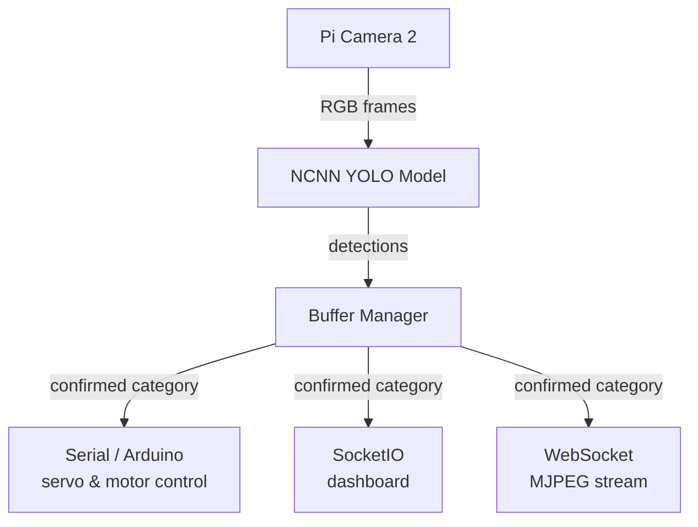

# README

# System Overview

> **Core role:** The central inference and orchestration process running on the Raspberry Pi 5. It captures live camera frames, runs object detection, interprets results through a voting buffer, and coordinates all downstream hardware responses via serial (Arduino), a web dashboard (SocketIO), and a live video stream (WebSocket).
> 

---

## System Architecture at a Glance



---

## Module Breakdown

---

### 1. Initialisation & Configuration

| Component | What it does |
| --- | --- |
| `config.py` | Defines labels, servo mappings, serial settings, model name, inference thresholds |
| `ErrorManager` | File that queues and emits structured errors to the dashboard using SocketIO |
| `SerialManager` | Manage the Pi ↔ Arduino connection reading evey serial-monitor line to translate the instruction and status to the dadhboard with reconnect logic |
| `SocketManager` | Maintains the SocketIO connection to the Flask dashboard server at `localhost` |
| `BufferManager` | Implements the vote window that prevent potentially noisy frame detections into confident category decisions based on majority votes |

 `SerialManager` and `SocketManager` are created **before** the model loads so that any model load failure can be reported to the dashboard immediately.

### 2. Servo / Category Mapping

The system classifies waste items into four categories, each mapped to a physical servo:

| Category | Servo | Arduino Pin |
| --- | --- | --- |
| `canister` | Servo 1 | Pin 12 |
| `chemical` | Servo 2 | Pin 13 |
| `applicator` | Servo 3 | Pin 14 |
| `inhaler` | Servo 4 | Pin 15 |

This mappings in `config.py` as `LABEL_TO_CATEGORY` and `SERVO_INDEX_TO_CATEGORY` is shared across every module in the system.

---

### 3. NCNN Object Detection

The model used is **YOLOv26  exported to NCNN format** for efficient inference on the Pi's ARM CPU.

**Optimisations applied:**

- `num_threads = 4` - uses all Pi CPU cores
- `fp16` packed/storage/arithmetic — half memory bandwidth

**Inference pipeline per frame:**

1. Capture RGB frame from `Picamera2`
2. Run custom **NMS** (non-maximum suppression) to remove duplicate boxes on the same device
3. Extract the highest-confidence detection → send it to the `BufferManager` to handle vote 

---

### 4. Majority-Vote Buffer (`BufferManager.py`)

As explained earlier a single misclassified frame could trigger a servo therefore the `BufferManager` solves this with a **vote that can be displayed on the dashboard**:

- Accumulates category labels consecutive frames
- Allows up to `gap_limit` frames without a detection before resetting the window
- Once the window is full, the **majority category** wins and a serial command is dispatched
- The active servo is locked with a timeout (`active_servo_until`) to prevent re-triggering
- to prevent from noisy detection the category is only send **if the number of frame is above the**  `min_frames` threshold

This design makes the system robust to:

- Partial occlusion of an item thought the detection
- Single or few frame model misdetection
- Brief gaps detection between for the same device on the conveyor

---

### 5. Three-Conveyor Motor Control

Three conveyor belts are tracked with their own locks:

| Conveyor | Arduino Pin |
| --- | --- |
| Conveyor 1 | Pin 10 |
| Conveyor 2 | Pin 9 |
| Conveyor 3 | Pin 8 |

Each conveyor is protected by a `threading.Lock`. Helper functions `_get_multi_conveyor_states()` and `_set_multi_conveyor_state(conv_id, running)` provide thread-safe access to prevent from inconsistent state between the dashboard and the button so that each can access the state one after the other.

Both conveyor 1 and 2 are dependent driving the main line while conveyor 3 is the indeed device part only providing a device each `X` minutes

---

### 6. Serial Protocol (Pi ↔ Arduino)

This is probably the most important part of the system which is the “language” shared by the **python** program and the **arduino,** The `serial_reader` thread continuously parses lines arriving from the Arduino translating each line and sending command. 

| Message | Meaning |
| --- | --- |
| `SENSOR:1:TRIGGERED` / `CLEAR` | Physical IR/proximity sensor on conveyor 1 |
| `SENSOR:2:TRIGGERED` / `CLEAR` | Physical IR/proximity sensor on conveyor 2 |
| `ACK:MOTOR:FORWARD` / `STOP` | Arduino confirms conveyor motor state change |
| `ACK:LABEL:<category>` | Arduino confirms it received the category label |
| `SERVO:X:OPEN` | Servo X has opened its bin flap |
| `SERVO:X:CLOSED_OK` | Servo X closed successfully |
| `SERVO:X:CLOSED_TIMEOUT` | Servo X failed to close in time — error condition |
| `SERVO:X:OBJECT_DETECTED` | Item detected in servo bin |
| `SERVO:X:BLOCKED` | Servo is mechanically blocked |
| `ERR:<detail>` | Arduino-side error |
| `INFO:<detail>` | Informational log from Arduino |

Multiple errors can also occurs therefore they are also printed by the arduino to be read by the  `serial_reader` and trigger the `raise_error` function in the `ErrorManager` to log the error and print it to the dashboard for debugging, the error are the following:

| Message | Meaning |
| --- | --- |
|  `ERR:SYSTEM:IS_NOT_RUNNING` |  Command ignored because system is not running  |
|  `ERR:SYSTEM:STOPPED` |  Conveyor inactive error (deprecated in new version)  |
|  `ERR:SYSTEM:NOT_RUNNING` |  Standardized system inactive state  |
|  `ERR:SYSTEM:EMERGENCY_STOP` |  Emergency stop triggered (hardware or safety loop)  |
|  `ERR:MOTOR:UNKNOWN:<arg>` |  Motor command not recognized  |
|  `ERR:SERVO:<id>:NOT_WIRED` |  Servo not detected / misconfigured wiring  |
|  `ERR:SERVO:<id>:WIRING:PULSE_OUT_OF_RANGE:<val>` |  PWM value out of safe range (PCA9685 safety check failure)  |
|  `ERR:SERVO:<id>:READBACK_FAILED` |  PCA9685 register readback mismatch detected  |
|  `ERR:SERIAL_WRITE_ERROR` |  Failure sending data to Arduino  |
|  `ERR:SERIAL_CONNECT_FAILED` |  Serial connection failed  |
|  `ERR:UNKNOWN_CMD` |  Command format not recognized  |
|  `ERR:BAD_CATEGORY:<category>` |  Label does not match known categories  |
|  `ERR:UNWIRING_DETECTED` |  Servo wiring detected as missing or unstable  |

Outgoing commands (Pi → Arduino) are sent via `serial.send()`.

---

### 7. Live Video Stream (WebSocket + MJPEG)

A background **encoder thread** continuously JPEG-compresses the latest annotated frame:

- Resolution: **480 × 480 px**
- JPEG quality: **35** (aggressive but sufficient for monitoring)
- Frame sequence number (`encoded_seq`) prevents re-sending the same frame to multiple clients

A `websockets` server runs on **port 8765**. Each connected client gets its own async handler that:

1. Checks whether a new frame is available (`seq != last_sent_seq`)
2. Sends it with a **100 ms timeout** — slow clients drop frames rather than blocking others
3. Targets ~**30 fps** per client via `asyncio.sleep(0.033)`

> These stream lag fixes (v2) — sequence numbers, timeouts, resolution cap, FPS cap — were introduced to prevent CPU saturation that occurred at the original 600 FPS target.
> 

---

### 8. Keyboard Control (Headless Mode)

Since there is no display, `cv2.waitKey` is replaced with **non-blocking `select()` on stdin**:

| Key | Action |
| --- | --- |
| `SPACE` | Simulate sensor trigger (for testing without hardware) |
| `C` | Simulate sensor clear |
| `Q` | Graceful shutdown |

The terminal is put into **cbreak mode** (`tty.setcbreak`) at startup and restored on exit via `termios.tcsetattr` in the `finally` block.

---

### 9. Main Inference Loop

```
while True:
  1. Capture frame from PiCamera2
  2. Run NCNN YOLO inference
  3. Apply NMS → best detection
  4. Feed category + confidence to BufferManager
  5. Push frame to WebSocket encoder
  6. Handle keyboard input
  7. Sleep for remainder of 33 ms frame budget
```

The **30 FPS cap** (`TARGET_FPS = 30`, `FRAME_BUDGET_S = 1/30`) prevents the loop from spinning the CPU. All `cv2.rectangle` / `cv2.putText` drawing calls are present in the code but **commented out** — the annotated frame was replaced with the clean camera frame to reduce encoding load.

---

### 10. Shutdown & Cleanup

The `finally` block ensures:

- WebSocket encoder thread flag is cleared
- Terminal settings are restored (`termios`)
- PiCamera2 is closed cleanly
- Serial port is closed

---

## Inter-module Dependencies

```
yolo_reader.py
├── ProgramManager/config.py          ← labels, thresholds, pin maps
├── ProgramManager/Buffer.py          ← BufferManager (majority vote)
├── ProgramManager/serialManager.py   ← SerialManager + serial_reader thread
├── ProgramManager/socketManager.py   ← SocketManager (Flask dashboard)
├── ProgramManager/event_bus.py       ← configure_emit / _async_emit
├── ProgramManager/ErrorManager.py    ← structured error reporting
└── ProgramManager/KeyboardSimulation.py ← kb_sensor_triggered/clear
```

---

## Key Configuration Values (from `config.py`)

| Parameter | Purpose |
| --- | --- |
| `input_size` | Model input resolution (e.g. 320 or 640) |
| `conf_thresh` | Minimum confidence to accept a detection |
| `nms_thresh` | IoU threshold for non-maximum suppression |
| `min_frames` | Votes required before a category is confirmed |
| `gap_limit` | Max empty frames before the vote window resets |
| `BAUD` / `PORT` | Serial connection to Arduino |
| `Yolo_model` | Sub-folder name of the NCNN model to load |
